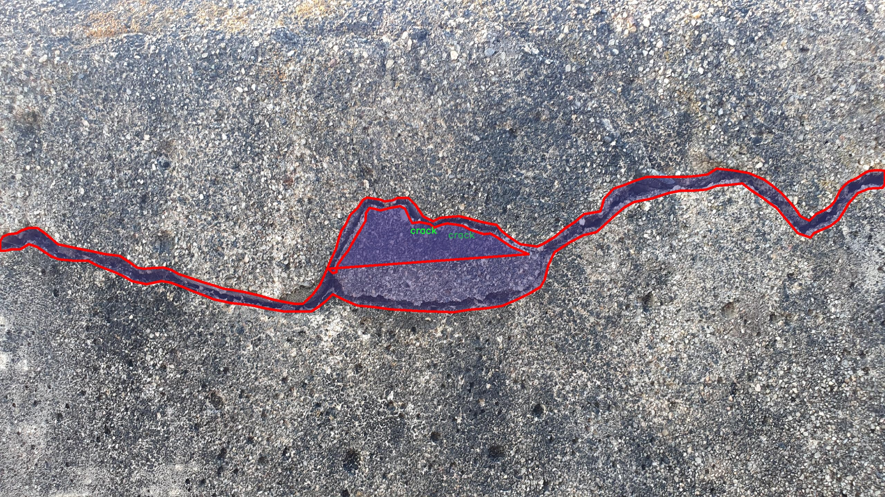

# 混凝土裂缝图像分割系统源码＆数据集分享
 [yolov8-seg-C2f-RFAConv＆yolov8-seg-C2f-SCConv等50+全套改进创新点发刊_一键训练教程_Web前端展示]

### 1.研究背景与意义

项目参考[ILSVRC ImageNet Large Scale Visual Recognition Challenge](https://gitee.com/YOLOv8_YOLOv11_Segmentation_Studio/projects)

项目来源[AAAI Global Al lnnovation Contest](https://kdocs.cn/l/cszuIiCKVNis)

研究背景与意义

随着城市化进程的加快，混凝土结构在建筑工程中得到了广泛应用。然而，混凝土在使用过程中不可避免地会出现裂缝，这不仅影响了建筑物的美观，更严重的是可能导致结构的安全隐患。因此，及时、准确地检测和评估混凝土裂缝的状态，对于保障建筑物的安全性和延长其使用寿命具有重要意义。传统的裂缝检测方法多依赖人工检查，费时费力且容易受到主观因素的影响，难以保证检测结果的准确性和一致性。随着计算机视觉和深度学习技术的迅猛发展，基于图像处理的自动化裂缝检测方法逐渐成为研究的热点。

在众多深度学习模型中，YOLO（You Only Look Once）系列因其高效的实时目标检测能力而受到广泛关注。YOLOv8作为该系列的最新版本，具备了更强的特征提取能力和更快的推理速度，能够在复杂的环境中进行准确的目标检测。然而，针对混凝土裂缝的检测与分割，YOLOv8仍存在一定的局限性，尤其是在处理细小裂缝和复杂背景时，模型的准确性和鲁棒性亟待提升。因此，基于改进YOLOv8的混凝土裂缝图像分割系统的研究具有重要的理论价值和实际意义。

本研究所使用的数据集包含1600幅图像，主要分为两类：裂缝和钢筋。该数据集的丰富性为模型的训练和验证提供了良好的基础。通过对裂缝图像的实例分割，不仅可以实现对裂缝的精确定位，还能为后续的裂缝宽度、深度等特征的量化分析提供数据支持。这对于工程师在进行结构评估时，能够更全面地了解混凝土的健康状态，进而制定相应的维护和加固方案，具有重要的应用价值。

此外，改进YOLOv8的混凝土裂缝图像分割系统的研究还将推动相关领域的技术进步。通过引入新的网络结构、优化算法和数据增强技术，可以有效提升模型在复杂场景下的表现，进而推动智能监测技术在建筑工程中的应用。随着智能化、自动化技术的不断发展，基于深度学习的裂缝检测系统将有望实现更高的检测效率和更低的人工成本，为建筑行业的数字化转型提供有力支持。

综上所述，基于改进YOLOv8的混凝土裂缝图像分割系统的研究，不仅为混凝土裂缝的自动检测提供了一种新的解决方案，还将推动相关技术的发展，具有重要的理论意义和广泛的应用前景。通过该研究，期望能够为混凝土结构的健康监测和维护提供更加高效、可靠的技术手段，为保障建筑安全贡献力量。

### 2.图片演示


##### 注意：由于此博客编辑较早，上面“2.图片演示”和“3.视频演示”展示的系统图片或者视频可能为老版本，新版本在老版本的基础上升级如下：（实际效果以升级的新版本为准）

  （1）适配了YOLOV8的“目标检测”模型和“实例分割”模型，通过加载相应的权重（.pt）文件即可自适应加载模型。

  （2）支持“图片识别”、“视频识别”、“摄像头实时识别”三种识别模式。

  （3）支持“图片识别”、“视频识别”、“摄像头实时识别”三种识别结果保存导出，解决手动导出（容易卡顿出现爆内存）存在的问题，识别完自动保存结果并导出到tempDir中。

  （4）支持Web前端系统中的标题、背景图等自定义修改，后面提供修改教程。

  另外本项目提供训练的数据集和训练教程,暂不提供权重文件（best.pt）,需要您按照教程进行训练后实现图片演示和Web前端界面演示的效果。

### 3.视频演示

[3.1 视频演示](https://www.bilibili.com/video/BV1oqSLYqEZh/)

### 4.数据集信息展示

##### 4.1 本项目数据集详细数据（类别数＆类别名）

nc: 1
names: ['crack']


##### 4.2 本项目数据集信息介绍

数据集信息展示

在现代建筑工程中，混凝土裂缝的检测与修复是确保结构安全与耐久性的重要环节。为了提高裂缝检测的效率与准确性，研究人员致力于开发基于深度学习的图像分割系统。在此背景下，"crack"数据集应运而生，专门用于训练改进YOLOv8-seg模型，以实现对混凝土裂缝的精准识别与分割。

"crack"数据集包含了大量的混凝土裂缝图像，旨在为模型提供丰富的训练样本。该数据集的类别数量为1，唯一的类别名称为“crack”，这表明数据集中所有的图像均围绕这一特定目标展开。通过聚焦于单一类别，研究者能够更深入地分析和理解混凝土裂缝的特征，从而提高模型在该领域的表现。

数据集中的图像来源于多种不同的环境和条件，包括新建混凝土结构、老旧建筑以及不同气候条件下的混凝土表面。这种多样性确保了模型在实际应用中的鲁棒性，能够适应不同的场景和裂缝类型。此外，数据集中包含的裂缝图像具有不同的尺寸、形状和纹理特征，这为模型提供了丰富的学习材料，使其能够捕捉到裂缝的多样性和复杂性。

在数据预处理阶段，研究人员对图像进行了标注和分割，确保每一张图像中的裂缝部分都被准确地标识出来。这一过程不仅提高了数据集的质量，也为后续的模型训练奠定了坚实的基础。通过精确的标注，YOLOv8-seg模型能够在训练过程中学习到裂缝的边界和特征，从而在实际应用中实现高效的裂缝检测。

为了进一步提升模型的性能，研究者们还采用了数据增强技术，对原始图像进行旋转、缩放、翻转等操作，以增加数据集的多样性。这种方法不仅可以有效缓解过拟合问题，还能提高模型在不同情况下的泛化能力。经过数据增强处理后的“crack”数据集，能够为模型提供更加丰富的学习经验，促进其在实际应用中的表现。

在训练过程中，研究人员将“crack”数据集与改进的YOLOv8-seg模型相结合，利用深度学习技术进行高效的图像分割。通过不断迭代和优化，模型能够逐步提高对混凝土裂缝的识别精度和分割效果。这一过程不仅有助于提升建筑工程的安全性，也为后续的裂缝修复工作提供了重要的技术支持。

总之，“crack”数据集在改进YOLOv8-seg的混凝土裂缝图像分割系统中发挥了至关重要的作用。通过提供丰富的训练样本和精确的标注信息，该数据集为研究人员开发高效的裂缝检测模型提供了坚实的基础，推动了混凝土结构安全检测技术的发展。随着深度学习技术的不断进步，未来在混凝土裂缝检测领域的应用前景将更加广阔。




### 5.全套项目环境部署视频教程（零基础手把手教学）

[5.1 环境部署教程链接（零基础手把手教学）](https://www.bilibili.com/video/BV1jG4Ve4E9t/?vd_source=bc9aec86d164b67a7004b996143742dc)


[5.2 安装Python虚拟环境创建和依赖库安装视频教程链接（零基础手把手教学）](https://www.bilibili.com/video/BV1nA4VeYEze/?vd_source=bc9aec86d164b67a7004b996143742dc)

### 6.手把手YOLOV8-seg训练视频教程（零基础小白有手就能学会）

[6.1 手把手YOLOV8-seg训练视频教程（零基础小白有手就能学会）](https://www.bilibili.com/video/BV1cA4VeYETe/?vd_source=bc9aec86d164b67a7004b996143742dc)


按照上面的训练视频教程链接加载项目提供的数据集，运行train.py即可开始训练



     Epoch   gpu_mem       box       obj       cls    labels  img_size
     1/200     0G   0.01576   0.01955  0.007536        22      1280: 100%|██████████| 849/849 [14:42<00:00,  1.04s/it]
               Class     Images     Labels          P          R     mAP@.5 mAP@.5:.95: 100%|██████████| 213/213 [01:14<00:00,  2.87it/s]
                 all       3395      17314      0.994      0.957      0.0957      0.0843

     Epoch   gpu_mem       box       obj       cls    labels  img_size
     2/200     0G   0.01578   0.01923  0.007006        22      1280: 100%|██████████| 849/849 [14:44<00:00,  1.04s/it]
               Class     Images     Labels          P          R     mAP@.5 mAP@.5:.95: 100%|██████████| 213/213 [01:12<00:00,  2.95it/s]
                 all       3395      17314      0.996      0.956      0.0957      0.0845

     Epoch   gpu_mem       box       obj       cls    labels  img_size
     3/200     0G   0.01561    0.0191  0.006895        27      1280: 100%|██████████| 849/849 [10:56<00:00,  1.29it/s]
               Class     Images     Labels          P          R     mAP@.5 mAP@.5:.95: 100%|███████   | 187/213 [00:52<00:00,  4.04it/s]
                 all       3395      17314      0.996      0.957      0.0957      0.0845


### 7.50+种全套YOLOV8-seg创新点代码加载调参视频教程（一键加载写好的改进模型的配置文件）

[7.1 50+种全套YOLOV8-seg创新点代码加载调参视频教程（一键加载写好的改进模型的配置文件）](https://www.bilibili.com/video/BV1Hw4VePEXv/?vd_source=bc9aec86d164b67a7004b996143742dc)

### 8.YOLOV8-seg图像分割算法原理

原始YOLOV8-seg算法原理

YOLOv8-seg算法是YOLO系列中的最新版本，代表了目标检测和分割领域的一次重要进步。该算法不仅继承了YOLO系列一贯的高效性和准确性，还在多个方面进行了创新和优化，特别是在图像分割任务中，展现出更为出色的性能。YOLOv8-seg的设计理念是将目标检测与图像分割相结合，形成一个统一的框架，使得模型能够在执行目标检测的同时，进行像素级的分割，从而实现更为精细的图像理解。

YOLOv8-seg的结构可以分为四个主要部分：输入层、Backbone骨干网络、Neck特征融合网络和Head检测模块。输入层负责对输入图像进行预处理，包括图像的缩放、归一化以及数据增强等操作。通过Mosaic增强技术，YOLOv8-seg能够有效地增加训练样本的多样性，从而提高模型的泛化能力。同时，输入层还通过瞄点计算来优化模型的特征提取过程，为后续的特征学习奠定基础。

在Backbone部分，YOLOv8-seg采用了先进的特征提取模块，主要基于DarkNet结构进行构建。与以往版本不同的是，YOLOv8-seg引入了C2f模块来替代传统的C3模块，这一创新设计旨在提高特征流动性，增强梯度的传递效果。C2f模块通过跨级连接的方式，有效地融合了不同层次的特征信息，保留了轻量级的特性，确保了模型在高效性的同时，能够提取到丰富的特征信息。此外，YOLOv8-seg还使用了快速空间金字塔池化（SPPF）模块，对输出特征图进行多尺度的处理，以适应不同大小目标的检测需求。

Neck部分则是YOLOv8-seg的特征融合网络，它采用了双塔结构，将特征金字塔和路径聚合网络相结合。通过这种结构，YOLOv8-seg能够有效地促进语义特征与定位特征之间的转移，进一步增强了特征融合的能力。这种多尺度特征融合的策略，使得模型在面对不同尺度的目标时，能够更好地捕捉到目标的特征信息，提高了检测的精度和鲁棒性。

在Head检测模块中，YOLOv8-seg采用了三个解耦的检测头，每个检测头负责不同尺度目标的检测任务。通过将回归分支和预测分支进行分离，YOLOv8-seg能够加速模型的收敛速度，提高检测效率。同时，新的损失策略也被引入到YOLOv8-seg中，包括变焦损失、数据平均保真度损失和完美交并比损失等。这些损失函数的设计，使得模型在训练过程中能够更加准确地进行目标检测和分割，提升了整体的性能。

值得注意的是，YOLOv8-seg不仅仅是一个目标检测算法，它在图像分割方面也表现出色。通过对特征图的细致处理，YOLOv8-seg能够实现像素级的分割，提供更为精确的分割结果。这一特性使得YOLOv8-seg在医学影像分析、自动驾驶、视频监控等多个领域都有着广泛的应用前景。

综上所述，YOLOv8-seg算法通过对传统YOLO结构的优化与创新，成功地将目标检测与图像分割结合在一起，形成了一个高效、准确且具有广泛适用性的模型。其独特的结构设计和先进的特征融合策略，使得YOLOv8-seg在处理复杂场景时，能够保持优异的性能表现。随着YOLOv8-seg的不断发展与完善，未来在智能视觉系统中的应用将更加广泛，推动着计算机视觉技术的进一步进步。


### 9.系统功能展示（检测对象为举例，实际内容以本项目数据集为准）

图9.1.系统支持检测结果表格显示

  图9.2.系统支持置信度和IOU阈值手动调节

  图9.3.系统支持自定义加载权重文件best.pt(需要你通过步骤5中训练获得)

  图9.4.系统支持摄像头实时识别

  图9.5.系统支持图片识别

  图9.6.系统支持视频识别

  图9.7.系统支持识别结果文件自动保存

  图9.8.系统支持Excel导出检测结果数据


### 10.50+种全套YOLOV8-seg创新点原理讲解（非科班也可以轻松写刊发刊，V11版本正在科研待更新）

#### 10.1 由于篇幅限制，每个创新点的具体原理讲解就不一一展开，具体见下列网址中的创新点对应子项目的技术原理博客网址【Blog】：


[10.1 50+种全套YOLOV8-seg创新点原理讲解链接](https://gitee.com/qunmasj/good)

#### 10.2 部分改进模块原理讲解(完整的改进原理见上图和技术博客链接)【如果此小节的图加载失败可以通过CSDN或者Github搜索该博客的标题访问原始博客，原始博客图片显示正常】

### Gold-YOLO简介
YOLO再升级：华为诺亚提出Gold-YOLO，聚集-分发机制打造新SOTA
在过去的几年中，YOLO系列模型已经成为实时目标检测领域的领先方法。许多研究通过修改架构、增加数据和设计新的损失函数，将基线推向了更高的水平。然而以前的模型仍然存在信息融合问题，尽管特征金字塔网络（FPN）和路径聚合网络（PANet）已经在一定程度上缓解了这个问题。因此，本研究提出了一种先进的聚集和分发机制（GD机制），该机制通过卷积和自注意力操作实现。这种新设计的模型被称为Gold-YOLO，它提升了多尺度特征融合能力，在所有模型尺度上实现了延迟和准确性的理想平衡。此外，本文首次在YOLO系列中实现了MAE风格的预训练，使得YOLO系列模型能够从无监督预训练中受益。Gold-YOLO-N在COCO val2017数据集上实现了出色的39.9% AP，并在T4 GPU上实现了1030 FPS，超过了之前的SOTA模型YOLOv6-3.0-N，其FPS相似，但性能提升了2.4%。


#### Gold-YOLO


YOLO系列的中间层结构采用了传统的FPN结构，其中包含多个分支用于多尺度特征融合。然而，它只充分融合来自相邻级别的特征，对于其他层次的信息只能间接地进行“递归”获取。

传统的FPN结构在信息传输过程中存在丢失大量信息的问题。这是因为层之间的信息交互仅限于中间层选择的信息，未被选择的信息在传输过程中被丢弃。这种情况导致某个Level的信息只能充分辅助相邻层，而对其他全局层的帮助较弱。因此，整体上信息融合的有效性可能受到限制。
为了避免在传输过程中丢失信息，本文采用了一种新颖的“聚集和分发”机制（GD），放弃了原始的递归方法。该机制使用一个统一的模块来收集和融合所有Level的信息，并将其分发到不同的Level。通过这种方式，作者不仅避免了传统FPN结构固有的信息丢失问题，还增强了中间层的部分信息融合能力，而且并没有显著增加延迟。


# 8.低阶聚合和分发分支 Low-stage gather-and-distribute branch
从主干网络中选择输出的B2、B3、B4、B5特征进行融合，以获取保留小目标信息的高分辨率特征。


低阶特征对齐模块 (Low-stage feature alignment module)： 在低阶特征对齐模块（Low-FAM）中，采用平均池化（AvgPool）操作对输入特征进行下采样，以实现统一的大小。通过将特征调整为组中最小的特征大小（ R B 4 = 1 / 4 R ） （R_{B4} = 1/4R）（R 
B4 =1/4R），我们得到对齐后的特征F a l i g n F_{align}F align 。低阶特征对齐技术确保了信息的高效聚合，同时通过变换器模块来最小化后续处理的计算复杂性。其中选择 R B 4 R_{B4}R B4 作为特征对齐的目标大小主要基于保留更多的低层信息的同时不会带来较大的计算延迟。
低阶信息融合模块(Low-stage information fusion module)： 低阶信息融合模块（Low-IFM）设计包括多层重新参数化卷积块（RepBlock）和分裂操作。具体而言，RepBlock以F a l i g n ( c h a n n e l = s u m ( C B 2 ， C B 3 ， C B 4 ， C B 5 ) ) F_{align} (channel= sum(C_{B2}，C_{B3}，C_{B4}，C_{B5}))F align (channel=sum(C B2 ，C B3 ，C B4 ，C B5 )作为输入，并生成F f u s e ( c h a n n e l = C B 4 + C B 5 ) F_{fuse} (channel= C_{B4} + C_{B5})F fuse (channel=C B4 +C B5 )。其中中间通道是一个可调整的值（例如256），以适应不同的模型大小。由RepBlock生成的特征随后在通道维度上分裂为F i n j P 3 Finj_P3Finj P 3和F i n j P 4 Finj_P4Finj P 4，然后与不同级别的特征进行融合。


# 8.高阶聚合和分发分支 High-stage gather-and-distribute branch
高级全局特征对齐模块（High-GD）将由低级全局特征对齐模块（Low-GD）生成的特征{P3, P4, P5}进行融合。


高级特征对齐模块(High-stage feature alignment module)： High-FAM由avgpool组成，用于将输入特征的维度减小到统一的尺寸。具体而言，当输入特征的尺寸为{R P 3 R_{P3}R P3 , R P 4 R_{P4}R P4 , R P 5 R_{P 5}R P5 }时，avgpool将特征尺寸减小到该特征组中最小的尺寸（R P 5 R_{P5}R P5  = 1/8R）。由于transformer模块提取了高层次的信息，池化操作有助于信息聚合，同时降低了transformer模块后续步骤的计算需求。

Transformer融合模块由多个堆叠的transformer组成，transformer块的数量为L。每个transformer块包括一个多头注意力块、一个前馈网络（FFN）和残差连接。采用与LeViT相同的设置来配置多头注意力块，使用16个通道作为键K和查询Q的头维度，32个通道作为值V的头维度。为了加速推理过程，将层归一化操作替换为批归一化，并将所有的GELU激活函数替换为ReLU。为了增强变换器块的局部连接，在两个1x1卷积层之间添加了一个深度卷积层。同时，将FFN的扩展因子设置为2，以在速度和计算成本之间取得平衡。

信息注入模块(Information injection module)： 高级全局特征对齐模块（High-GD）中的信息注入模块与低级全局特征对齐模块（Low-GD）中的相同。在高级阶段，局部特征（Flocal）等于Pi，因此公式如下所示：


### 增强的跨层信息流动 Enhanced cross-layer information flow
为了进一步提升性能，从YOLOv8 中的PAFPN模块中得到启发，引入了Inject-LAF模块。该模块是注入模块的增强版，包括了一个轻量级相邻层融合（LAF）模块，该模块被添加到注入模块的输入位置。为了在速度和准确性之间取得平衡，设计了两个LAF模型：LAF低级模型和LAF高级模型，分别用于低级注入（合并相邻两层的特征）和高级注入（合并相邻一层的特征）。它们的结构如图5(b)所示。为了确保来自不同层级的特征图与目标大小对齐，在实现中的两个LAF模型仅使用了三个操作符：双线性插值（上采样过小的特征）、平均池化（下采样过大的特征）和1x1卷积（调整与目标通道不同的特征）。模型中的LAF模块与信息注入模块的结合有效地平衡了准确性和速度之间的关系。通过使用简化的操作，能够增加不同层级之间的信息流路径数量，从而提高性能而不显著增加延迟。


### 11.项目核心源码讲解（再也不用担心看不懂代码逻辑）

#### 11.1 ui.py

以下是经过简化和注释的核心代码部分：

```python
import sys
import subprocess

def run_script(script_path):
    """
    使用当前 Python 环境运行指定的脚本。

    Args:
        script_path (str): 要运行的脚本路径
    """
    # 获取当前 Python 解释器的路径
    python_path = sys.executable

    # 构建运行命令，使用 streamlit 运行指定的脚本
    command = f'"{python_path}" -m streamlit run "{script_path}"'

    # 执行命令并等待其完成
    result = subprocess.run(command, shell=True)
    
    # 检查命令执行结果，如果返回码不为0，则表示出错
    if result.returncode != 0:
        print("脚本运行出错。")

# 主程序入口
if __name__ == "__main__":
    # 指定要运行的脚本路径
    script_path = "web.py"  # 这里可以直接指定脚本名称

    # 调用函数运行脚本
    run_script(script_path)
```

### 代码分析和注释：
1. **导入模块**：
   - `sys`：用于访问与 Python 解释器相关的变量和函数。
   - `subprocess`：用于执行外部命令和与其交互。

2. **`run_script` 函数**：
   - 该函数接受一个脚本路径作为参数，并使用当前 Python 环境来运行该脚本。
   - 使用 `sys.executable` 获取当前 Python 解释器的路径，以确保脚本在正确的环境中运行。
   - 构建一个命令字符串，使用 `streamlit` 模块来运行指定的脚本。
   - `subprocess.run` 用于执行构建的命令，并等待其完成。
   - 检查命令的返回码，如果返回码不为0，表示脚本运行过程中出现了错误，打印错误信息。

3. **主程序入口**：
   - 使用 `if __name__ == "__main__":` 确保只有在直接运行该脚本时才会执行以下代码。
   - 指定要运行的脚本路径（在这里直接使用了 `"web.py"`）。
   - 调用 `run_script` 函数来执行指定的脚本。 

这个简化版本保留了代码的核心功能，并提供了详细的中文注释以帮助理解。

这个文件名为 `ui.py`，主要功能是运行一个指定的 Python 脚本，具体是使用 Streamlit 框架来启动一个 Web 应用。文件中导入了几个模块，包括 `sys`、`os` 和 `subprocess`，以及一个自定义的路径处理模块 `abs_path`。

在文件的开头，定义了一个名为 `run_script` 的函数。这个函数接收一个参数 `script_path`，它是要运行的脚本的路径。函数内部首先获取当前 Python 解释器的路径，这通过 `sys.executable` 实现。接着，构建一个命令字符串，该命令用于在命令行中运行 Streamlit，格式为 `python -m streamlit run script_path`。这里的 `script_path` 是传入的参数，表示要运行的脚本。

然后，使用 `subprocess.run` 方法执行这个命令。这个方法会在一个新的子进程中运行命令，并等待其完成。如果脚本运行过程中返回的状态码不为 0，表示出现了错误，此时会打印出“脚本运行出错”的提示信息。

在文件的最后部分，使用 `if __name__ == "__main__":` 语句来判断当前模块是否是主程序。如果是主程序，则指定要运行的脚本路径，这里是通过调用 `abs_path("web.py")` 获取的。最后，调用 `run_script` 函数来执行指定的脚本。

整体来看，这个文件的主要作用是封装了一个简单的接口，通过命令行运行一个 Streamlit 应用，便于用户启动 Web 应用。

#### 11.2 ultralytics\models\yolo\classify\val.py

以下是代码中最核心的部分，并附上详细的中文注释：

```python
import torch
from ultralytics.data import ClassificationDataset, build_dataloader
from ultralytics.engine.validator import BaseValidator
from ultralytics.utils.metrics import ClassifyMetrics, ConfusionMatrix
from ultralytics.utils.plotting import plot_images

class ClassificationValidator(BaseValidator):
    """
    继承自 BaseValidator 类的分类验证器，用于基于分类模型的验证。
    """

    def __init__(self, dataloader=None, save_dir=None, pbar=None, args=None, _callbacks=None):
        """初始化 ClassificationValidator 实例，设置数据加载器、保存目录、进度条和参数。"""
        super().__init__(dataloader, save_dir, pbar, args, _callbacks)
        self.targets = None  # 真实标签
        self.pred = None     # 预测结果
        self.args.task = 'classify'  # 设置任务类型为分类
        self.metrics = ClassifyMetrics()  # 初始化分类指标

    def init_metrics(self, model):
        """初始化混淆矩阵、类名和 top-1、top-5 准确率。"""
        self.names = model.names  # 获取模型的类名
        self.nc = len(model.names)  # 类别数量
        self.confusion_matrix = ConfusionMatrix(nc=self.nc, conf=self.args.conf, task='classify')  # 初始化混淆矩阵
        self.pred = []  # 存储预测结果
        self.targets = []  # 存储真实标签

    def preprocess(self, batch):
        """预处理输入批次并返回处理后的批次。"""
        batch['img'] = batch['img'].to(self.device, non_blocking=True)  # 将图像数据转移到设备上
        batch['img'] = batch['img'].half() if self.args.half else batch['img'].float()  # 根据参数选择数据类型
        batch['cls'] = batch['cls'].to(self.device)  # 将标签转移到设备上
        return batch

    def update_metrics(self, preds, batch):
        """使用模型预测和批次目标更新运行指标。"""
        n5 = min(len(self.names), 5)  # 获取前5个预测结果
        self.pred.append(preds.argsort(1, descending=True)[:, :n5])  # 按照预测结果排序并保存
        self.targets.append(batch['cls'])  # 保存真实标签

    def finalize_metrics(self, *args, **kwargs):
        """最终化模型的指标，如混淆矩阵和速度。"""
        self.confusion_matrix.process_cls_preds(self.pred, self.targets)  # 处理预测结果和真实标签
        self.metrics.speed = self.speed  # 记录速度
        self.metrics.confusion_matrix = self.confusion_matrix  # 保存混淆矩阵

    def get_stats(self):
        """返回通过处理目标和预测获得的指标字典。"""
        self.metrics.process(self.targets, self.pred)  # 处理真实标签和预测结果
        return self.metrics.results_dict  # 返回结果字典

    def build_dataset(self, img_path):
        """使用给定的图像路径和预处理参数创建并返回 ClassificationDataset 实例。"""
        return ClassificationDataset(root=img_path, args=self.args, augment=False, prefix=self.args.split)

    def get_dataloader(self, dataset_path, batch_size):
        """构建并返回用于分类任务的数据加载器。"""
        dataset = self.build_dataset(dataset_path)  # 创建数据集
        return build_dataloader(dataset, batch_size, self.args.workers, rank=-1)  # 返回数据加载器

    def print_results(self):
        """打印 YOLO 目标检测模型的评估指标。"""
        pf = '%22s' + '%11.3g' * len(self.metrics.keys)  # 打印格式
        LOGGER.info(pf % ('all', self.metrics.top1, self.metrics.top5))  # 打印 top-1 和 top-5 准确率

    def plot_val_samples(self, batch, ni):
        """绘制验证图像样本。"""
        plot_images(
            images=batch['img'],
            batch_idx=torch.arange(len(batch['img'])),
            cls=batch['cls'].view(-1),  # 使用 .view() 而不是 .squeeze() 以适应分类模型
            fname=self.save_dir / f'val_batch{ni}_labels.jpg',
            names=self.names,
            on_plot=self.on_plot)

    def plot_predictions(self, batch, preds, ni):
        """在输入图像上绘制预测结果并保存结果。"""
        plot_images(batch['img'],
                    batch_idx=torch.arange(len(batch['img'])),
                    cls=torch.argmax(preds, dim=1),  # 获取预测的类别
                    fname=self.save_dir / f'val_batch{ni}_pred.jpg',
                    names=self.names,
                    on_plot=self.on_plot)  # 绘制预测结果
```

### 代码核心部分说明：
1. **初始化和设置**：在`__init__`方法中，初始化了验证器的基本参数，并设置了任务类型为分类。
2. **指标初始化**：`init_metrics`方法用于初始化混淆矩阵和类别信息，以便后续计算准确率。
3. **数据预处理**：`preprocess`方法负责将输入数据转移到适当的设备上，并根据需要转换数据类型。
4. **更新指标**：`update_metrics`方法用于更新预测结果和真实标签，以便后续计算性能指标。
5. **最终化指标**：`finalize_metrics`方法处理并保存最终的混淆矩阵和速度信息。
6. **获取统计信息**：`get_stats`方法返回处理后的指标结果。
7. **数据集和数据加载器**：`build_dataset`和`get_dataloader`方法用于创建数据集和数据加载器，便于后续训练和验证过程。
8. **结果打印和绘图**：`print_results`、`plot_val_samples`和`plot_predictions`方法用于打印评估结果和绘制验证样本及预测结果。

这个程序文件是一个用于分类模型验证的类，名为 `ClassificationValidator`，它继承自 `BaseValidator` 类。该类的主要功能是对分类模型进行验证，计算并输出相关的分类指标。

首先，文件导入了一些必要的库和模块，包括 PyTorch、数据集处理、验证器基类、日志记录、分类指标、混淆矩阵和图像绘制工具。`ClassificationValidator` 类的构造函数初始化了一些参数，包括数据加载器、保存目录、进度条和其他参数。它还定义了 `targets` 和 `pred` 属性，用于存储真实标签和模型预测结果，并将任务类型设置为“分类”。

在 `get_desc` 方法中，返回一个格式化的字符串，概述了分类指标，包括类别名称、Top-1 准确率和 Top-5 准确率。`init_metrics` 方法用于初始化混淆矩阵、类别名称以及 Top-1 和 Top-5 准确率的计算。

`preprocess` 方法负责对输入批次进行预处理，将图像数据转移到指定设备上，并根据需要转换数据类型。`update_metrics` 方法则在每个批次中更新模型的预测结果和真实标签，以便后续计算指标。

`finalize_metrics` 方法用于最终处理模型的指标，包括混淆矩阵和速度等信息。如果设置了绘图选项，它还会绘制混淆矩阵并保存到指定目录。`get_stats` 方法返回一个包含处理后的真实标签和预测结果的指标字典。

`build_dataset` 方法创建并返回一个 `ClassificationDataset` 实例，用于加载图像数据。`get_dataloader` 方法则根据给定的参数构建并返回一个数据加载器，以便在训练或验证过程中使用。

`print_results` 方法用于打印 YOLO 模型的评估指标，包括 Top-1 和 Top-5 准确率。`plot_val_samples` 和 `plot_predictions` 方法分别用于绘制验证图像样本和在输入图像上绘制预测结果，并将结果保存到指定文件中。

总体来说，这个文件实现了分类模型验证的完整流程，包括数据加载、预处理、指标计算和结果可视化，适用于使用 YOLO 模型进行图像分类任务的场景。

#### 11.3 ultralytics\models\nas\__init__.py

以下是代码中最核心的部分，并附上详细的中文注释：

```python
# 导入必要的模块和类
from .model import NAS  # 从当前包的model模块中导入NAS类
from .predict import NASPredictor  # 从当前包的predict模块中导入NASPredictor类
from .val import NASValidator  # 从当前包的val模块中导入NASValidator类

# 定义模块的公开接口
__all__ = 'NASPredictor', 'NASValidator', 'NAS'  # 指定在使用from module import *时，公开的类和函数
```

### 注释说明：
1. **导入模块**：
   - `from .model import NAS`：这行代码从当前包的`model`模块中导入了`NAS`类，`NAS`可能是一个神经网络架构或模型的定义。
   - `from .predict import NASPredictor`：这行代码从当前包的`predict`模块中导入了`NASPredictor`类，`NASPredictor`可能用于对输入数据进行预测。
   - `from .val import NASValidator`：这行代码从当前包的`val`模块中导入了`NASValidator`类，`NASValidator`可能用于验证模型的性能。

2. **定义公开接口**：
   - `__all__`：这是一个特殊变量，用于定义当使用`from module import *`时，哪些名称是可以被导入的。在这里，只有`NASPredictor`、`NASValidator`和`NAS`这三个类会被公开，其他未列出的名称将不会被导入。这有助于控制模块的命名空间，避免不必要的名称冲突。

这个程序文件是Ultralytics YOLO项目中的一个初始化文件，通常用于定义模块的公共接口。在这个文件中，首先引入了三个类：`NAS`、`NASPredictor`和`NASValidator`，它们分别来自于同一目录下的不同模块。

`NAS`类可能是与神经架构搜索（Neural Architecture Search）相关的模型类，用于构建和训练YOLO（You Only Look Once）目标检测模型。`NASPredictor`类则可能用于执行预测操作，利用训练好的模型对新数据进行推断。`NASValidator`类则可能用于验证模型的性能，评估其在验证集上的表现。

在文件的最后，使用`__all__`变量定义了模块的公共接口，指定了在使用`from module import *`时应该导入的类。这意味着，当其他模块导入这个包时，只会看到`NASPredictor`、`NASValidator`和`NAS`这三个类，隐藏了其他可能存在的内部实现细节。

整体来看，这个文件的主要作用是组织和暴露与NAS相关的功能，便于其他模块或用户进行调用和使用。

#### 11.4 ultralytics\trackers\track.py

以下是经过简化和详细注释的核心代码部分：

```python
# 导入必要的库
from functools import partial
import torch
from ultralytics.utils import IterableSimpleNamespace, yaml_load
from ultralytics.utils.checks import check_yaml
from .bot_sort import BOTSORT
from .byte_tracker import BYTETracker

# 定义跟踪器映射字典
TRACKER_MAP = {'bytetrack': BYTETracker, 'botsort': BOTSORT}

def on_predict_start(predictor, persist=False):
    """
    在预测开始时初始化对象跟踪器。

    参数:
        predictor (object): 用于初始化跟踪器的预测器对象。
        persist (bool, optional): 如果跟踪器已存在，是否保持其状态。默认为 False。

    异常:
        AssertionError: 如果 tracker_type 不是 'bytetrack' 或 'botsort'。
    """
    # 如果预测器已经有跟踪器并且需要保持状态，则直接返回
    if hasattr(predictor, 'trackers') and persist:
        return
    
    # 检查并加载跟踪器配置
    tracker = check_yaml(predictor.args.tracker)
    cfg = IterableSimpleNamespace(**yaml_load(tracker))
    
    # 确保跟踪器类型有效
    assert cfg.tracker_type in ['bytetrack', 'botsort'], \
        f"只支持 'bytetrack' 和 'botsort'，但得到了 '{cfg.tracker_type}'"
    
    # 初始化跟踪器列表
    trackers = []
    for _ in range(predictor.dataset.bs):
        # 根据配置创建跟踪器实例
        tracker = TRACKER_MAP[cfg.tracker_type](args=cfg, frame_rate=30)
        trackers.append(tracker)
    
    # 将跟踪器列表赋值给预测器
    predictor.trackers = trackers

def on_predict_postprocess_end(predictor):
    """后处理检测到的框并更新对象跟踪。"""
    bs = predictor.dataset.bs  # 批量大小
    im0s = predictor.batch[1]  # 原始图像数据
    for i in range(bs):
        det = predictor.results[i].boxes.cpu().numpy()  # 获取检测结果
        if len(det) == 0:
            continue  # 如果没有检测到目标，跳过
        
        # 更新跟踪器并获取跟踪结果
        tracks = predictor.trackers[i].update(det, im0s[i])
        if len(tracks) == 0:
            continue  # 如果没有跟踪到目标，跳过
        
        idx = tracks[:, -1].astype(int)  # 获取有效的索引
        predictor.results[i] = predictor.results[i][idx]  # 更新检测结果
        predictor.results[i].update(boxes=torch.as_tensor(tracks[:, :-1]))  # 更新框信息

def register_tracker(model, persist):
    """
    为模型注册跟踪回调，以便在预测期间进行对象跟踪。

    参数:
        model (object): 要注册跟踪回调的模型对象。
        persist (bool): 如果跟踪器已存在，是否保持其状态。
    """
    # 添加预测开始时的回调
    model.add_callback('on_predict_start', partial(on_predict_start, persist=persist))
    # 添加后处理结束时的回调
    model.add_callback('on_predict_postprocess_end', on_predict_postprocess_end)
```

### 代码说明：
1. **导入模块**：导入了必要的库和模块，用于对象跟踪和配置加载。
2. **跟踪器映射**：定义了一个字典，用于将跟踪器类型映射到具体的跟踪器类。
3. **`on_predict_start` 函数**：在预测开始时初始化跟踪器，检查配置文件并创建跟踪器实例。
4. **`on_predict_postprocess_end` 函数**：在预测后处理阶段更新检测框和跟踪信息。
5. **`register_tracker` 函数**：将跟踪回调注册到模型中，以便在预测过程中调用。

这个程序文件主要用于在Ultralytics YOLO模型中实现对象跟踪功能。文件中导入了一些必要的库和模块，包括`torch`和一些Ultralytics的工具函数。文件的核心功能是通过定义回调函数来在预测过程中初始化和更新跟踪器。

首先，文件定义了一个跟踪器映射`TRACKER_MAP`，将不同类型的跟踪器（如BYTETracker和BOTSORT）映射到相应的类。这使得在后续的代码中可以根据配置动态选择使用的跟踪器类型。

接下来，`on_predict_start`函数用于在预测开始时初始化跟踪器。该函数接受一个预测器对象和一个可选的持久化参数。如果预测器已经有跟踪器并且持久化参数为真，则直接返回。否则，它会检查配置文件中指定的跟踪器类型，并确保只支持'bytetrack'和'botsort'这两种类型。然后，它为每个批次的样本创建相应的跟踪器实例，并将这些实例存储在预测器的`trackers`属性中。

`on_predict_postprocess_end`函数则是在预测后处理阶段被调用，用于更新检测到的框并进行对象跟踪。它遍历每个批次的结果，提取检测到的框。如果没有检测到框，则跳过该批次。如果有检测到的框，则调用相应的跟踪器的`update`方法，传入检测框和图像数据，获取跟踪结果。最后，根据跟踪结果更新预测器的结果，确保只保留有效的跟踪框。

最后，`register_tracker`函数用于将上述回调函数注册到模型中，以便在预测过程中能够自动调用这些函数。该函数接受模型对象和持久化参数，并将回调函数与模型的预测事件关联起来。

总体来说，这个文件的主要目的是在YOLO模型的预测过程中集成对象跟踪功能，通过灵活的回调机制来管理跟踪器的初始化和更新。

#### 11.5 ultralytics\models\yolo\classify\__init__.py

以下是保留的核心代码部分，并附上详细的中文注释：

```python
# 导入Ultralytics YOLO库中的分类预测、训练和验证模块
from ultralytics.models.yolo.classify.predict import ClassificationPredictor  # 导入分类预测器
from ultralytics.models.yolo.classify.train import ClassificationTrainer      # 导入分类训练器
from ultralytics.models.yolo.classify.val import ClassificationValidator      # 导入分类验证器

# 定义模块的公开接口，允许外部访问这三个类
__all__ = 'ClassificationPredictor', 'ClassificationTrainer', 'ClassificationValidator'
```

### 注释说明：
1. **导入模块**：
   - `ClassificationPredictor`：用于进行图像分类的预测，能够加载训练好的模型并对新图像进行分类。
   - `ClassificationTrainer`：用于训练分类模型，包含数据加载、模型训练和参数优化等功能。
   - `ClassificationValidator`：用于验证分类模型的性能，通常在训练后评估模型在验证集上的表现。

2. **`__all__` 变量**：
   - 该变量定义了模块的公共接口，只有在使用 `from module import *` 时，才会导入这些指定的类。这有助于控制模块的可见性和使用方式。

这个程序文件是Ultralytics YOLO项目中的一个模块，主要用于分类任务。文件的开头包含了版权信息，表明该代码遵循AGPL-3.0许可证。

在文件中，首先从`ultralytics.models.yolo.classify.predict`模块导入了`ClassificationPredictor`类，这个类负责进行分类预测。接着，从`ultralytics.models.yolo.classify.train`模块导入了`ClassificationTrainer`类，用于训练分类模型。最后，从`ultralytics.models.yolo.classify.val`模块导入了`ClassificationValidator`类，这个类用于验证分类模型的性能。

文件的最后一行定义了`__all__`变量，这个变量是一个字符串元组，列出了该模块公开的接口，包括`ClassificationPredictor`、`ClassificationTrainer`和`ClassificationValidator`。这意味着，当使用`from ultralytics.models.yolo.classify import *`这样的语句时，只会导入这三个类，其他未列出的内容将不会被导入。这种做法有助于清晰地定义模块的公共API，避免不必要的命名冲突和混淆。

### 12.系统整体结构（节选）

### 程序整体功能和构架概括

该程序是一个基于Ultralytics YOLO框架的计算机视觉项目，主要用于目标检测和分类任务。程序的结构清晰，模块化设计使得各个功能可以独立开发和维护。整体上，程序包括用户界面、模型训练、验证、预测和对象跟踪等多个方面。以下是各个文件的功能概述：

- **ui.py**: 提供一个用户界面，允许用户通过命令行启动一个Streamlit Web应用来运行指定的Python脚本。
- **ultralytics/models/yolo/classify/val.py**: 实现分类模型的验证功能，计算并输出分类指标，支持混淆矩阵和准确率的可视化。
- **ultralytics/models/nas/__init__.py**: 定义与神经架构搜索（NAS）相关的公共接口，导入和暴露模型、预测器和验证器类。
- **ultralytics/trackers/track.py**: 实现对象跟踪功能，通过回调机制在YOLO模型的预测过程中集成跟踪器的初始化和更新。
- **ultralytics/models/yolo/classify/__init__.py**: 定义分类模块的公共接口，导入和暴露分类预测器、训练器和验证器类。

### 文件功能整理表

| 文件路径                                      | 功能描述                                                                                   |
|-------------------------------------------|----------------------------------------------------------------------------------------|
| `C:\codeseg\codenew\code\ui.py`          | 提供用户界面，通过命令行启动Streamlit Web应用以运行指定的Python脚本。                        |
| `C:\codeseg\codenew\code\ultralytics\models\yolo\classify\val.py` | 实现分类模型的验证功能，计算分类指标，支持混淆矩阵和准确率的可视化。                           |
| `C:\codeseg\codenew\code\ultralytics\models\nas\__init__.py`     | 定义与神经架构搜索（NAS）相关的公共接口，导入和暴露模型、预测器和验证器类。                     |
| `C:\codeseg\codenew\code\ultralytics\trackers\track.py`          | 实现对象跟踪功能，通过回调机制在YOLO模型的预测过程中集成跟踪器的初始化和更新。                 |
| `C:\codeseg\codenew\code\ultralytics\models\yolo\classify\__init__.py` | 定义分类模块的公共接口，导入和暴露分类预测器、训练器和验证器类。                             |

这个表格清晰地展示了每个文件的功能，便于理解程序的整体架构和各个模块之间的关系。

注意：由于此博客编辑较早，上面“11.项目核心源码讲解（再也不用担心看不懂代码逻辑）”中部分代码可能会优化升级，仅供参考学习，完整“训练源码”、“Web前端界面”和“50+种创新点源码”以“14.完整训练+Web前端界面+50+种创新点源码、数据集获取”的内容为准。

### 13.图片、视频、摄像头图像分割Demo(去除WebUI)代码

在这个博客小节中，我们将讨论如何在不使用WebUI的情况下，实现图像分割模型的使用。本项目代码已经优化整合，方便用户将分割功能嵌入自己的项目中。
核心功能包括图片、视频、摄像头图像的分割，ROI区域的轮廓提取、类别分类、周长计算、面积计算、圆度计算以及颜色提取等。
这些功能提供了良好的二次开发基础。

### 核心代码解读

以下是主要代码片段，我们会为每一块代码进行详细的批注解释：

```python
import random
import cv2
import numpy as np
from PIL import ImageFont, ImageDraw, Image
from hashlib import md5
from model import Web_Detector
from chinese_name_list import Label_list

# 根据名称生成颜色
def generate_color_based_on_name(name):
    ......

# 计算多边形面积
def calculate_polygon_area(points):
    return cv2.contourArea(points.astype(np.float32))

...
# 绘制中文标签
def draw_with_chinese(image, text, position, font_size=20, color=(255, 0, 0)):
    image_pil = Image.fromarray(cv2.cvtColor(image, cv2.COLOR_BGR2RGB))
    draw = ImageDraw.Draw(image_pil)
    font = ImageFont.truetype("simsun.ttc", font_size, encoding="unic")
    draw.text(position, text, font=font, fill=color)
    return cv2.cvtColor(np.array(image_pil), cv2.COLOR_RGB2BGR)

# 动态调整参数
def adjust_parameter(image_size, base_size=1000):
    max_size = max(image_size)
    return max_size / base_size

# 绘制检测结果
def draw_detections(image, info, alpha=0.2):
    name, bbox, conf, cls_id, mask = info['class_name'], info['bbox'], info['score'], info['class_id'], info['mask']
    adjust_param = adjust_parameter(image.shape[:2])
    spacing = int(20 * adjust_param)

    if mask is None:
        x1, y1, x2, y2 = bbox
        aim_frame_area = (x2 - x1) * (y2 - y1)
        cv2.rectangle(image, (x1, y1), (x2, y2), color=(0, 0, 255), thickness=int(3 * adjust_param))
        image = draw_with_chinese(image, name, (x1, y1 - int(30 * adjust_param)), font_size=int(35 * adjust_param))
        y_offset = int(50 * adjust_param)  # 类别名称上方绘制，其下方留出空间
    else:
        mask_points = np.concatenate(mask)
        aim_frame_area = calculate_polygon_area(mask_points)
        mask_color = generate_color_based_on_name(name)
        try:
            overlay = image.copy()
            cv2.fillPoly(overlay, [mask_points.astype(np.int32)], mask_color)
            image = cv2.addWeighted(overlay, 0.3, image, 0.7, 0)
            cv2.drawContours(image, [mask_points.astype(np.int32)], -1, (0, 0, 255), thickness=int(8 * adjust_param))

            # 计算面积、周长、圆度
            area = cv2.contourArea(mask_points.astype(np.int32))
            perimeter = cv2.arcLength(mask_points.astype(np.int32), True)
            ......

            # 计算色彩
            mask = np.zeros(image.shape[:2], dtype=np.uint8)
            cv2.drawContours(mask, [mask_points.astype(np.int32)], -1, 255, -1)
            color_points = cv2.findNonZero(mask)
            ......

            # 绘制类别名称
            x, y = np.min(mask_points, axis=0).astype(int)
            image = draw_with_chinese(image, name, (x, y - int(30 * adjust_param)), font_size=int(35 * adjust_param))
            y_offset = int(50 * adjust_param)

            # 绘制面积、周长、圆度和色彩值
            metrics = [("Area", area), ("Perimeter", perimeter), ("Circularity", circularity), ("Color", color_str)]
            for idx, (metric_name, metric_value) in enumerate(metrics):
                ......

    return image, aim_frame_area

# 处理每帧图像
def process_frame(model, image):
    pre_img = model.preprocess(image)
    pred = model.predict(pre_img)
    det = pred[0] if det is not None and len(det)
    if det:
        det_info = model.postprocess(pred)
        for info in det_info:
            image, _ = draw_detections(image, info)
    return image

if __name__ == "__main__":
    cls_name = Label_list
    model = Web_Detector()
    model.load_model("./weights/yolov8s-seg.pt")

    # 摄像头实时处理
    cap = cv2.VideoCapture(0)
    while cap.isOpened():
        ret, frame = cap.read()
        if not ret:
            break
        ......

    # 图片处理
    image_path = './icon/OIP.jpg'
    image = cv2.imread(image_path)
    if image is not None:
        processed_image = process_frame(model, image)
        ......

    # 视频处理
    video_path = ''  # 输入视频的路径
    cap = cv2.VideoCapture(video_path)
    while cap.isOpened():
        ret, frame = cap.read()
        ......
```


### 14.完整训练+Web前端界面+50+种创新点源码、数据集获取


# [下载链接：https://mbd.pub/o/bread/Zp6Zkptx](https://mbd.pub/o/bread/Zp6Zkptx)